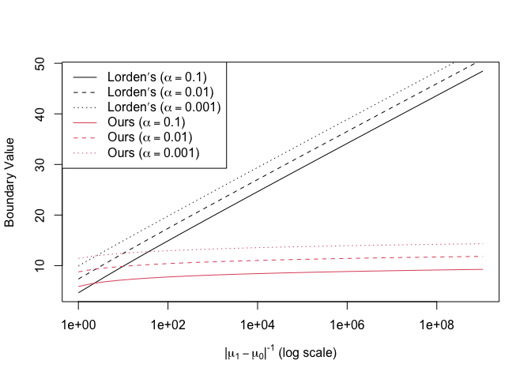
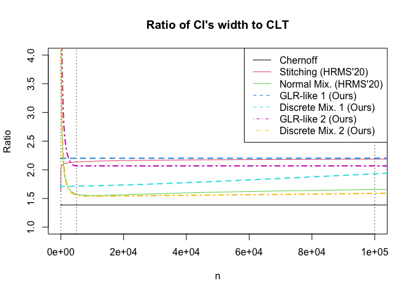

<!-- README.md is generated from README.Rmd. Please edit that file -->

# SGLRT

<!-- badges: start -->

<!-- badges: end -->

`SGLRT` is a R package implementation of Sequential Generalized
Likelihood Ratio (GLR)-like Tests and confidence sequences in **Paper**.

## Installation

You can install the `SGLRT` package from [GitHub](https://github.com/)
with:

``` r
# install.packages("devtools")
devtools::install_github("shinjaehyeok/SGLRT_paper")
```

<!---You can install the released version of SGLRT from [CRAN](https://CRAN.R-project.org) with:

``` r
install.packages("SGLRT")
```
-->

## How to reproduce all plots and simulation results in **paper**.

To reproduce plots, you need to install `latex2exp` package which parses
and converts LaTeX math formulas to R’s plotmath expressions. It is is
not installed, you can run the following command to install is.

``` r
install.packages("latex2exp")
```

### 1\. Compare boundaries for sequential GLR tests. *(Fig. 3 in Section III-A)*

The following Rcode reproduces the Fig. 3 in Section III-A in which we
compared Lorden’s and ours boundary values of sequential GLR test for
normal distributions.

``` r
library(latex2exp)
library(SGLRT)


alpha <- 10^seq(-1,-10)
theta_vec <- c(1,0.5, 10^seq(-1,-10)) 
theta_vec <- 2^seq(0,-30)

d_vec <- theta_vec^2 / 2

for (i in seq_along(alpha[1:3])){
  f_lorden <- function(d) const_boundary_lorden(alpha[i], d)
  lorden <- sapply(d_vec, f_lorden)
  f_ours <- function(d) const_boundary(alpha[i], d)
  ours  <- sapply(d_vec, f_ours)
  if (i == 1){
    plot(1/theta_vec, unlist(lorden["g",]), type = "l", 
         log ="x",
         ylab = "Boundary Value",
         xlab = TeX("$|\\mu_1 - \\mu_0|^{-1}$ (log scale)"))
    points(1/theta_vec, unlist(ours["g",]), type = "l", col = 2)
  } else {
    points(1/theta_vec, unlist(lorden["g",]), type = "l", col = 1,
           lty = i)
    points(1/theta_vec, unlist(ours["g",]), type = "l", col = 2,
           lty = i)
  }
}
legend("topleft", 
       TeX(c(paste0("Lorden's ($\\alpha = ", alpha[1:3],"$)"), 
             paste0("Ours ($\\alpha = ", alpha[1:3],"$)"))),
       col = c(rep(1,3), rep(2,3)), lty = rep(1:3,2))
```



### 2\. Ratio of CI’s width to CLT *(Fig. 5 in Section IV-C)*

The following Rcode reproduces the Fig. 5 in Section IV-C in which we
compared ratios of widths of confidence intervals to the pointwise and
asymptotically valid normal confidence intervals based on the central
limit theorem. To be specific, `Chernoff` is the nonasymptotic but
pointwise valid confidence interval based on the Chernoff bound.
`Stitching (HRMS'20)` and `Normal Mix. (HRMS'20)` are nonasymptotic and
anytime-valid confidence intervals presented by [Howard et al.,
(2020+)](https://arxiv.org/abs/1810.08240). `GLR-like (Ours)` and
`Discrete Mix. (Ours)` are two nonasymptotic and anytime-valid
confidence intervals proposed in our paper. `GLR-like` confidence
intervals are based on the GLR statistics and its nonparametric
extension, called GLR-like statistics. `GLR-like` confidence intervals
are time-uniformly close to the Chrenoff bound on any given target time
interval. `Discrete Mix.` confidence intervals are refined version of
`GLR-like` ones. From the construction, `Discrete Mix.` confidence
intervals are always tighter than their corresponding `GLR-like`
confidence intervals. In the following plots, we use two different
target time intervals to build `GLR-like` and `Discrete Mix.` confidence
intervals.

``` r
library(SGLRT)

# Chernoff
chornoff <- function(v, alpha = 0.025){
  sqrt(2  * log(1/alpha) / v)
}

# Normal mixture function
normal_mix <- function(v, alpha = 0.025, rho = 1260){
  sqrt(2 * (1/v + rho / v^2) * log(1/(2*alpha) * sqrt((v + rho)/rho) + 1)) 
}

#Stitching
stitch <- function(v, alpha = 0.025){
  1.7 * sqrt((log(log(2) + log(v)) + 0.72 * log(5.2/alpha)) / v) 
}

# CLT
CLT <- function(v, alpha = 0.025){
  qnorm(1-alpha) / sqrt(v)
}

# Functions to construct our bounds
# First one has target interval [1, nmax]
# Second one has target interval [nmax / 20, nmax * 4]

alpha <- 0.025
nmax <- 1e+5

nmax1 <- nmax
nmin1 = 1

nmax2 <- nmax1 * 4
nmin2 <- nmax1 / 20


ours1 <- SGLR_CI_additive(alpha, nmax1, nmin1)
ours2 <- SGLR_CI_additive(alpha, nmax2, nmin2)


# Compute the width of CIs on exponentially-spaced grid.
M <- log(nmax, base = 10)
v <- 10^(seq(0,M + 0.2, length.out = 100))


# Compute existing bounds
chornoff_vec <- sapply(v, chornoff)
CLT_vec <- sapply(v, CLT)
normal_mix_vec <- sapply(v, normal_mix)
stit_vec <- sapply(v, stitch)

existing_list <- list(stitch = stit_vec,
                      normal_mix = normal_mix_vec)

# Compute our bounds
GLR_like_1_vec <- sapply(v, ours1$GLR_like_fn)
GLR_like_2_vec <- sapply(v, ours2$GLR_like_fn)
our_dis_mix_1_vec <- sapply(v, ours1$dis_mix_fn)
our_dis_mix_2_vec <- sapply(v, ours2$dis_mix_fn)


ours_list_1 <- list(GLR_like_1 = GLR_like_1_vec,
                    our_dis_mix_1 = our_dis_mix_1_vec)

ours_list_2 <- list(GLR_like_2 = GLR_like_2_vec,
                    our_dis_mix_2 = our_dis_mix_2_vec)

# Plot ratio of bounds
title <- "Ratio of CI's width to CLT"
plot(v, chornoff_vec / CLT_vec, type = "l",
     main = title,
     ylab = "Ratio",
     xlab = "n",
     ylim = c(1, 4),
     xlim = c(1, nmax))
col = 1
legend_col <- c(1)
for (i in seq_along(existing_list)){
  col <- col + 1
  legend_col <- c(legend_col, col)
  lines(v, existing_list[[i]] / CLT_vec, col = col)
}
legend_lty <- rep(1, length(existing_list) + 1)
for (i in seq_along(ours_list_1)){
  col <- col + 1
  legend_col <- c(legend_col, col)
  lines(v, ours_list_1[[i]] / CLT_vec,
        lty = 2, lwd = 2, col = col)
}
legend_lty <- c(legend_lty, rep(2, length(ours_list_1)))
for (i in seq_along(ours_list_2)){
  col <- col + 1
  legend_col <- c(legend_col, col)
  lines(v, ours_list_2[[i]] / CLT_vec,
        lty = 4, lwd = 2, col = col)
}
legend_lty <- c(legend_lty, rep(4, length(ours_list_2)))
abline(v = c(nmin1, nmin2, nmax1, nmax2), lty = 3)
bounds_name <- c("Chernoff", "Stitching (HRMS'20)", "Normal Mix. (HRMS'20)",
                 "GLR-like 1 (Ours)", "Discrete Mix. 1 (Ours)",
                 "GLR-like 2 (Ours)", "Discrete Mix. 2 (Ours)")
legend("topright", bounds_name,
       lty = legend_lty,
       col = legend_col,
       bg= "white")
```


