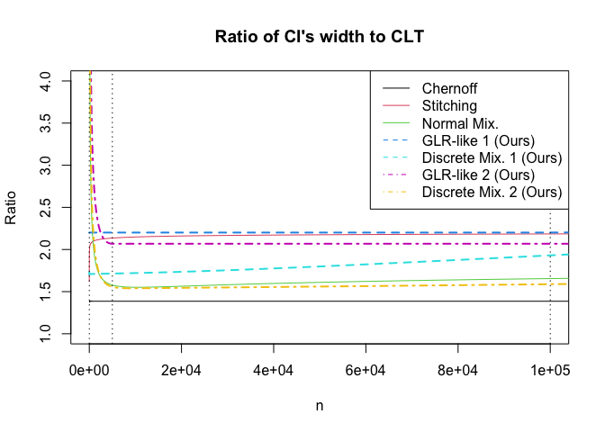

<!-- README.md is generated from README.Rmd. Please edit that file -->

# SGLRT

<!-- badges: start -->

<!-- badges: end -->

`SGLRT` is a R package implementation of Sequential Generalized
Likelihood Ratio (GLR)-like Tests and confidence sequences in **Paper**.

## Installation

You can install the `SGLRT` package from [GitHub](https://github.com/)
with:

``` r
# install.packages("devtools")
devtools::install_github("shinjaehyeok/SGLRT_paper")
```

<!---You can install the released version of SGLRT from [CRAN](https://CRAN.R-project.org) with:

``` r
install.packages("SGLRT")
```
-->

## How to reproduce all plots and simulation results in **paper**.

To reproduce plots, you need to install `latex2exp` package which parses
and converts LaTeX math formulas to R’s plotmath expressions. It is is
not installed, you can run the following command to install is.

``` r
install.packages("latex2exp")
```

### 1\. Compare boundaries for sequential GLR tests. *(Fig. 3 in Section III-A)*

The following Rcode reproduces the Fig. 3 in Section III-A in which we
compared Lorden’s and ours boundary values of sequential GLR test for
normal distributions.

``` r
library(latex2exp)
library(SGLRT)


alpha <- 10^seq(-1,-10)
theta_vec <- c(1,0.5, 10^seq(-1,-10)) 
theta_vec <- 2^seq(0,-30)

d_vec <- theta_vec^2 / 2

for (i in seq_along(alpha[1:3])){
  f_lorden <- function(d) const_boundary_lorden(alpha[i], d)
  lorden <- sapply(d_vec, f_lorden)
  f_ours <- function(d) const_boundary(alpha[i], d)
  ours  <- sapply(d_vec, f_ours)
  if (i == 1){
    plot(1/theta_vec, unlist(lorden["g",]), type = "l", 
         log ="x",
         ylab = "Boundary Value",
         xlab = TeX("$|\\mu_1 - \\mu_0|^{-1}$ (log scale)"))
    points(1/theta_vec, unlist(ours["g",]), type = "l", col = 2)
  } else {
    points(1/theta_vec, unlist(lorden["g",]), type = "l", col = 1,
           lty = i)
    points(1/theta_vec, unlist(ours["g",]), type = "l", col = 2,
           lty = i)
  }
}
legend("topleft", 
       TeX(c(paste0("Lorden's ($\\alpha = ", alpha[1:3],"$)"), 
             paste0("Ours ($\\alpha = ", alpha[1:3],"$)"))),
       col = c(rep(1,3), rep(2,3)), lty = rep(1:3,2))
```


### 2\. Ratio of CI’s width to CLT *(Fig. 5 in Section IV-C)*

The following Rcode reproduces the Fig. 5 in Section IV-C in which we
compared ratios of widths of confidence intervals to the pointwise and
asymptotically valid normal confidence intervals based on the central
limit theorem. To be specific, `Chernoff` is the nonasymptotic but
pointwise valid confidence interval based on the Chernoff bound.
`Stitching (HRMS'20)` and `Normal Mix. (HRMS'20)` are nonasymptotic and
anytime-valid confidence intervals presented by [Howard et al.,
(2020+)](https://arxiv.org/abs/1810.08240). `GLR-like (Ours)` and
`Discrete Mix. (Ours)` are two nonasymptotic and anytime-valid
confidence intervals proposed in our paper. `GLR-like` confidence
intervals are based on the GLR statistics and its nonparametric
extension, called GLR-like statistics. `GLR-like` confidence intervals
are time-uniformly close to the Chrenoff bound on any given target time
interval. `Discrete Mix.` confidence intervals are refined version of
`GLR-like` ones. From the construction, `Discrete Mix.` confidence
intervals are always tighter than their corresponding `GLR-like`
confidence intervals. In the following plots, we use two different
target time intervals to build `GLR-like` and `Discrete Mix.` confidence
intervals.

``` r
library(SGLRT)

# Chernoff
chornoff <- function(v, alpha = 0.025){
  sqrt(2  * log(1/alpha) / v)
}

# Normal mixture function
normal_mix <- function(v, alpha = 0.025, rho = 1260){
  sqrt(2 * (1/v + rho / v^2) * log(1/(2*alpha) * sqrt((v + rho)/rho) + 1)) 
}

#Stitching
stitch <- function(v, alpha = 0.025){
  1.7 * sqrt((log(log(2) + log(v)) + 0.72 * log(5.2/alpha)) / v) 
}

# CLT
CLT <- function(v, alpha = 0.025){
  qnorm(1-alpha) / sqrt(v)
}

# Functions to construct our bounds
# First one has target interval [1, nmax]
# Second one has target interval [nmax / 20, nmax * 4]

alpha <- 0.025
nmax <- 1e+5

nmax1 <- nmax
nmin1 = 1

nmax2 <- nmax1 * 4
nmin2 <- nmax1 / 20


ours1 <- SGLR_CI_additive(alpha, nmax1, nmin1)
ours2 <- SGLR_CI_additive(alpha, nmax2, nmin2)


# Compute the width of CIs on exponentially-spaced grid.
M <- log(nmax, base = 10)
v <- 10^(seq(0,M + 0.2, length.out = 100))


# Compute existing bounds
chornoff_vec <- sapply(v, chornoff)
CLT_vec <- sapply(v, CLT)
normal_mix_vec <- sapply(v, normal_mix)
stit_vec <- sapply(v, stitch)

existing_list <- list(stitch = stit_vec,
                      normal_mix = normal_mix_vec)

# Compute our bounds
GLR_like_1_vec <- sapply(v, ours1$GLR_like_fn)
GLR_like_2_vec <- sapply(v, ours2$GLR_like_fn)
our_dis_mix_1_vec <- sapply(v, ours1$dis_mix_fn)
our_dis_mix_2_vec <- sapply(v, ours2$dis_mix_fn)


ours_list_1 <- list(GLR_like_1 = GLR_like_1_vec,
                    our_dis_mix_1 = our_dis_mix_1_vec)

ours_list_2 <- list(GLR_like_2 = GLR_like_2_vec,
                    our_dis_mix_2 = our_dis_mix_2_vec)

# Plot ratio of bounds
title <- "Ratio of CI's width to CLT"
plot(v, chornoff_vec / CLT_vec, type = "l",
     main = title,
     ylab = "Ratio",
     xlab = "n",
     ylim = c(1, 4),
     xlim = c(1, nmax))
col = 1
legend_col <- c(1)
for (i in seq_along(existing_list)){
  col <- col + 1
  legend_col <- c(legend_col, col)
  lines(v, existing_list[[i]] / CLT_vec, col = col)
}
legend_lty <- rep(1, length(existing_list) + 1)
for (i in seq_along(ours_list_1)){
  col <- col + 1
  legend_col <- c(legend_col, col)
  lines(v, ours_list_1[[i]] / CLT_vec,
        lty = 2, lwd = 2, col = col)
}
legend_lty <- c(legend_lty, rep(2, length(ours_list_1)))
for (i in seq_along(ours_list_2)){
  col <- col + 1
  legend_col <- c(legend_col, col)
  lines(v, ours_list_2[[i]] / CLT_vec,
        lty = 4, lwd = 2, col = col)
}
legend_lty <- c(legend_lty, rep(4, length(ours_list_2)))
abline(v = c(nmin1, nmin2, nmax1, nmax2), lty = 3)
bounds_name <- c("Chernoff", "Stitching (HRMS'20)", "Normal Mix. (HRMS'20)",
                 "GLR-like 1 (Ours)", "Discrete Mix. 1 (Ours)",
                 "GLR-like 2 (Ours)", "Discrete Mix. 2 (Ours)")
legend("topright", bounds_name,
       lty = legend_lty,
       col = legend_col,
       bg= "white")
```



### 3\. Ratio of CI’s width to CLT *(Fig. 5 in Section IV-C)*

The following Rcode reproduces the Fig. 5 in Section IV-C in which we
compared ratios of widths of confidence intervals to the pointwise and
asymptotically valid normal confidence intervals based on the central
limit theorem. To be specific, `Chernoff` is the nonasymptotic but
pointwise valid confidence interval based on the Chernoff bound.
`Stitching (HRMS'20)` and `Normal Mix. (HRMS'20)` are nonasymptotic and
anytime-valid confidence intervals presented by [Howard et al.,
(2020+)](https://arxiv.org/abs/1810.08240). `GLR-like (Ours)` and
`Discrete Mix. (Ours)` are two nonasymptotic and anytime-valid
confidence intervals proposed in our paper. `GLR-like` confidence
intervals are based on the GLR statistics and its nonparametric
extension, called GLR-like statistics. `GLR-like` confidence intervals
are time-uniformly close to the Chrenoff bound on any given target time
interval. `Discrete Mix.` confidence intervals are refined version of
`GLR-like` ones. From the construction, `Discrete Mix.` confidence
intervals are always tighter than their corresponding `GLR-like`
confidence intervals. In the following plots, we use two different
target time intervals to build `GLR-like` and `Discrete Mix.` confidence
intervals.

``` r
# Type 1 and Type 2 error control simulation
library(SGLRT)

# Define functions for tests based on a fixed sample size.

# Compute power of Z-test
G_pwr <- function(n, mu_target, mu_0, alpha){
  thres_exact <- qnorm(alpha, mu_0, sd = 1/sqrt(n), lower.tail = FALSE)
  pwr <- pnorm(thres_exact, mu_target, sd = 1/sqrt(n), lower.tail = FALSE)
  return(pwr)
}

# Z-test function (reject the null if the returned value is positive)
z_test <- function(x_bar, n, mu_0, alpha){
  z_alpha <- qnorm(1-alpha)
  x_bar - mu_0 - z_alpha / sqrt(n)
}

# Compute power of binomial test
binom_pwr <- function(n, mu_target, mu_0, alpha){
  n <- floor(n)
  thres_exact <- qbinom(alpha, n, mu_0, lower.tail = FALSE)
  pwr <- pbinom(thres_exact, n, mu_target, lower.tail = FALSE)
  return(pwr)
}

# Exact binomial test (reject the null if the returned value is positive)
binom_test <- function(x_bar, n, mu_0, alpha){
  thres_exact <- qbinom(alpha, n, mu_0, lower.tail = FALSE)
  return(x_bar * n - thres_exact)
}

# Sequential tests

# GLR-like and discrete mixture test for sub-Gaussian
seq_G_test_generator <- function(alpha, nmax, nmin){
  G_out <- SGLR_CI(alpha, nmax, nmin)
  return(G_out)
} 

# GLR-like and discrete mixture test for sub-Bernoulli
ber_fn_list <- generate_sub_ber_fn()
seq_ber_test_generator <- function(alpha, nmax, nmin){
  ber_out <- SGLR_CI(alpha,
                     nmax, 
                     nmin,
                     breg = ber_fn_list$breg,
                     breg_pos_inv = ber_fn_list$breg_pos_inv,
                     breg_neg_inv = ber_fn_list$breg_neg_inv,
                     breg_derv = ber_fn_list$breg_derv,
                     mu_lower = ber_fn_list$mu_lower,
                     mu_upper = ber_fn_list$mu_upper,
                     grid_by = ber_fn_list$grid_by)
  return(ber_out)
} 

# Sample generators
# Gaussian samples
G_sample <- function(n, mu_true){
  rnorm(n, mean = mu_true)
}

# Bernoulli samples
ber_sample <- function(n, mu_true){
  rbinom(n, 1, prob = mu_true)
}

# R function to simulate sequential test and fixed sample size test.
test_simul <- function(mu_target,
                       mu_true = mu_target,
                       mu_0 = 0.5,
                       alpha = 0.05,
                       beta = 0.8, 
                       B = 1000,
                       print_progress = TRUE,
                       print_result = FALSE,
                       sample_generator = G_sample,
                       power_fn = G_pwr,
                       fixed_test_fn = z_test,
                       seq_test_fn = seq_G_test_generator){
  
  # Calculate sample size to achieve the target power by the fixed sample size test
  if (mu_target > mu_0){
    sample_size <- stats::uniroot(function(n){
      power_fn(n, mu_target, mu_0, alpha) - beta
    },
    c(10, 1e+4))$root
    n_exact <- ceiling(sample_size) 
  } else if (mu_target == mu_0){
    n_exact <- 1e+3
  } else {
    stop("This simulation is designed for mu_target >= mu_0 case. Need to use larger mu_target")
  }
  
  # Set terminal time of sequential test. 
  n <- 2 * n_exact
  
  # Set target time interval
  nmax <- n
  nmin <- round(max(10, n_exact / 10))
  
  # Range of experimentation
  n_vec <- seq(1, n)
  
  # Define test functions
  test_list <- list(exact = NULL,
                    GLR_like = NULL,
                    dis_mix = NULL
  )
  
  # Exact test
  test_list$exact <- function(x_bar, n){
    exact_out <-  fixed_test_fn(x_bar, n, mu_0, alpha)
    return(exact_out)
  }
  
  
  # Sequential tests
  G_out <- seq_test_fn(alpha, nmax, nmin)
  
  
  GLR_test <- G_out$log_GLR_like_stat_generator(mu_0, is_pos = TRUE)
  test_list$GLR_like <- GLR_test$stat_fn
  
  dis_mix_test <- G_out$log_dis_mart_generator(mu_0, is_pos = TRUE)
  test_list$dis_mix <- dis_mix_test$stat_fn
  
  
  # Type 1 error or power simulation
  is_reject <- function(test_value){
    num_reject <- sum(test_value > 0)
    return(ifelse(num_reject > 0, 1 ,0))
  }
  
  reject <- list(exact_hacking = numeric(B),
                 GLR_like = numeric(B),
                 dis_mix = numeric(B),
                 exact_test = numeric(B))
  
  sample_size_list <- list(exact_hacking = numeric(B),
                           GLR_like = numeric(B),
                           dis_mix = numeric(B),
                           exact_test = numeric(B))
  i <- 0
  if (print_progress)  pb <- txtProgressBar(min = 0, max = B, style = 3)
  while (i < B){
    i <- i + 1
    x_vec <- sample_generator(n, mu_true)
    x_bar_vec <- cumsum(x_vec) / n_vec
    test_value_list <- list(exact_hacking = NULL,
                            GLR_like = NULL,
                            dis_mix = NULL,
                            exact_test = NULL
    )
    for (j in seq_along(test_list)){
      test_value_list[[j]] <- mapply(test_list[[j]], x_bar_vec, n_vec)      
    }
    test_value_list$exact_test <-  test_value_list$exact_hacking[n_exact]
    
    for (k in seq_along(test_value_list)){
      if (k == length(test_value_list)) next
      reject_n <- which(test_value_list[[k]] >= 0)
      stopped_n <- ifelse(length(reject_n) == 0, n, min(reject_n)) 
      sample_size_list[[k]][i] <- stopped_n
      reject[[k]][i] <- is_reject(test_value_list[[k]])
    }
    sample_size_list$exact_test[i] <- n_exact
    reject$exact_test[i] <- is_reject(test_value_list$exact_test)
    if (print_progress) setTxtProgressBar(pb, i)
  }
  if (print_progress)  close(pb)
  
  reject_rate <- sapply(reject, mean)
  sample_size <- sapply(sample_size_list, mean)
  early_stop_ratio <- sapply(seq(1, length(sample_size_list)), 
                             function(k) mean(sample_size_list[[k]] <= n_exact))
  out <- list(reject_rate = reject_rate,
              sample_size = sample_size,
              reject_list = reject,
              sample_size_list = sample_size_list,
              early_stop_ratio = early_stop_ratio,
              mu_target = mu_target,
              mu_true = mu_true,
              mu_0 = mu_0,
              alpha = alpha,
              beta = beta)
  
  if (print_result){
    print(reject_rate)
    print(sample_size)
    print(early_stop_ratio)
    hist(sample_size_list$dis_mix, xlim = c(1, n))
    abline(v = n_exact)
  }
  return(out)
}

# Function to summurize the simulation result
summ_simul <- function(result_name,
                       simul_out,
                       mu_true_vec){
  out <-   data.frame(mu_true = mu_true_vec, 
                      exact_hacking = numeric(length(mu_true_vec)),
                      GLR_like = numeric(length(mu_true_vec)),
                      dis_mix = numeric(length(mu_true_vec)),
                      exact_test = numeric(length(mu_true_vec)))
  for (i in seq_along(mu_true_vec)){
    out[i, -1] <- simul_out[[i]][[result_name]]
  }
  return(out)
}
```

#### 3-1. Gaussian case

``` r
# Gaussian simulation
set.seed(1)
f_simul <- function(mu) {
  out <- test_simul(mu_target = 0.1,
                    mu_true = mu,
                    mu_0 = 0,
                    alpha = 0.1,
                    beta = 0.9,
                    B = 100,
                    print_progress = FALSE,
                    print_result = FALSE)
  return(out)
}

mu_true_vec <- seq(-0.05, 0.2, by = 0.05)
simul_G_out <- lapply(mu_true_vec, f_simul)

reject_rate_G <- summ_simul("reject_rate", 
                          simul_G_out,
                          mu_true_vec)
sample_size_G <- summ_simul("sample_size",
                          simul_G_out,
                          mu_true_vec)
early_stop_ratio_G <- summ_simul("early_stop_ratio",
                               simul_G_out,
                               mu_true_vec)

print_type <- "html"
print(xtable::xtable(reject_rate_G,
                     caption = "Estimated probabilities of rejecting the null hypothesis. (Gaussian)"),
      type = print_type)
```

<!-- html table generated in R 4.0.2 by xtable 1.8-4 package -->

<!-- Thu Oct  1 23:56:55 2020 -->

<table border="1">

<caption align="bottom">

Estimated probabilities of rejecting the null hypothesis. (Gaussian)

</caption>

<tr>

<th>

</th>

<th>

mu\_true

</th>

<th>

exact\_hacking

</th>

<th>

GLR\_like

</th>

<th>

dis\_mix

</th>

<th>

exact\_test

</th>

</tr>

<tr>

<td align="right">

1

</td>

<td align="right">

\-0.05

</td>

<td align="right">

0.48

</td>

<td align="right">

0.00

</td>

<td align="right">

0.05

</td>

<td align="right">

0.01

</td>

</tr>

<tr>

<td align="right">

2

</td>

<td align="right">

0.00

</td>

<td align="right">

0.60

</td>

<td align="right">

0.02

</td>

<td align="right">

0.07

</td>

<td align="right">

0.08

</td>

</tr>

<tr>

<td align="right">

3

</td>

<td align="right">

0.05

</td>

<td align="right">

0.91

</td>

<td align="right">

0.11

</td>

<td align="right">

0.44

</td>

<td align="right">

0.52

</td>

</tr>

<tr>

<td align="right">

4

</td>

<td align="right">

0.10

</td>

<td align="right">

1.00

</td>

<td align="right">

0.69

</td>

<td align="right">

0.88

</td>

<td align="right">

0.86

</td>

</tr>

<tr>

<td align="right">

5

</td>

<td align="right">

0.15

</td>

<td align="right">

1.00

</td>

<td align="right">

0.99

</td>

<td align="right">

1.00

</td>

<td align="right">

1.00

</td>

</tr>

<tr>

<td align="right">

6

</td>

<td align="right">

0.20

</td>

<td align="right">

1.00

</td>

<td align="right">

1.00

</td>

<td align="right">

1.00

</td>

<td align="right">

1.00

</td>

</tr>

</table>

``` r

print(xtable::xtable(sample_size_G[c(1,3,4,5)],
                     caption = "Estimated average sample sizes of testing procedures. (Gaussian)"),
      type = print_type)
```

<!-- html table generated in R 4.0.2 by xtable 1.8-4 package -->

<!-- Thu Oct  1 23:56:55 2020 -->

<table border="1">

<caption align="bottom">

Estimated average sample sizes of testing procedures. (Gaussian)

</caption>

<tr>

<th>

</th>

<th>

mu\_true

</th>

<th>

GLR\_like

</th>

<th>

dis\_mix

</th>

<th>

exact\_test

</th>

</tr>

<tr>

<td align="right">

1

</td>

<td align="right">

\-0.05

</td>

<td align="right">

1314.00

</td>

<td align="right">

1252.01

</td>

<td align="right">

657.00

</td>

</tr>

<tr>

<td align="right">

2

</td>

<td align="right">

0.00

</td>

<td align="right">

1300.92

</td>

<td align="right">

1241.63

</td>

<td align="right">

657.00

</td>

</tr>

<tr>

<td align="right">

3

</td>

<td align="right">

0.05

</td>

<td align="right">

1240.67

</td>

<td align="right">

951.47

</td>

<td align="right">

657.00

</td>

</tr>

<tr>

<td align="right">

4

</td>

<td align="right">

0.10

</td>

<td align="right">

897.85

</td>

<td align="right">

473.77

</td>

<td align="right">

657.00

</td>

</tr>

<tr>

<td align="right">

5

</td>

<td align="right">

0.15

</td>

<td align="right">

506.40

</td>

<td align="right">

240.82

</td>

<td align="right">

657.00

</td>

</tr>

<tr>

<td align="right">

6

</td>

<td align="right">

0.20

</td>

<td align="right">

272.49

</td>

<td align="right">

114.01

</td>

<td align="right">

657.00

</td>

</tr>

</table>

``` r
print(xtable::xtable(early_stop_ratio_G[c(1,3,4)],
                     caption = "Estimated probabilities of tests being stopped earlier than Z-test."),
      type = print_type)
```

<!-- html table generated in R 4.0.2 by xtable 1.8-4 package -->

<!-- Thu Oct  1 23:56:55 2020 -->

<table border="1">

<caption align="bottom">

Estimated probabilities of tests being stopped earlier than Z-test.

</caption>

<tr>

<th>

</th>

<th>

mu\_true

</th>

<th>

GLR\_like

</th>

<th>

dis\_mix

</th>

</tr>

<tr>

<td align="right">

1

</td>

<td align="right">

\-0.05

</td>

<td align="right">

0.00

</td>

<td align="right">

0.05

</td>

</tr>

<tr>

<td align="right">

2

</td>

<td align="right">

0.00

</td>

<td align="right">

0.01

</td>

<td align="right">

0.06

</td>

</tr>

<tr>

<td align="right">

3

</td>

<td align="right">

0.05

</td>

<td align="right">

0.06

</td>

<td align="right">

0.33

</td>

</tr>

<tr>

<td align="right">

4

</td>

<td align="right">

0.10

</td>

<td align="right">

0.30

</td>

<td align="right">

0.71

</td>

</tr>

<tr>

<td align="right">

5

</td>

<td align="right">

0.15

</td>

<td align="right">

0.71

</td>

<td align="right">

0.96

</td>

</tr>

<tr>

<td align="right">

6

</td>

<td align="right">

0.20

</td>

<td align="right">

0.97

</td>

<td align="right">

1.00

</td>

</tr>

</table>

#### 3-2. Bernoulli case

``` r
# Bernoulli simulation
set.seed(1)
f_simul <- function(mu) {
  out <- test_simul(mu_target = 0.12,
                    mu_true = mu,
                    mu_0 = 0.1,
                    alpha = 0.1,
                    beta = 0.9,
                    B = 100,
                    print_progress = FALSE,
                    print_result = FALSE,
                    sample_generator = ber_sample,
                    power_fn = binom_pwr,
                    fixed_test_fn = binom_test,
                    seq_test_fn = seq_ber_test_generator)
  return(out)
}

mu_true_vec <- seq(0.09, 0.14, by = 0.01)
simul_ber_out <- lapply(mu_true_vec, f_simul)

reject_rate_ber <- summ_simul("reject_rate", 
                          simul_ber_out,
                          mu_true_vec)
sample_size_ber <- summ_simul("sample_size",
                          simul_ber_out,
                          mu_true_vec)
early_stop_ratio_ber <- summ_simul("early_stop_ratio",
                               simul_ber_out,
                               mu_true_vec)

print_type <- "html"
print(xtable::xtable(reject_rate_ber,
                     caption = "Estimated probabilities of rejecting the null hypothesis. (Bernoulli)"),
      type = print_type)
```

<!-- html table generated in R 4.0.2 by xtable 1.8-4 package -->

<!-- Thu Oct  1 23:58:56 2020 -->

<table border="1">

<caption align="bottom">

Estimated probabilities of rejecting the null hypothesis. (Bernoulli)

</caption>

<tr>

<th>

</th>

<th>

mu\_true

</th>

<th>

exact\_hacking

</th>

<th>

GLR\_like

</th>

<th>

dis\_mix

</th>

<th>

exact\_test

</th>

</tr>

<tr>

<td align="right">

1

</td>

<td align="right">

0.09

</td>

<td align="right">

0.39

</td>

<td align="right">

0.00

</td>

<td align="right">

0.01

</td>

<td align="right">

0.02

</td>

</tr>

<tr>

<td align="right">

2

</td>

<td align="right">

0.10

</td>

<td align="right">

0.62

</td>

<td align="right">

0.01

</td>

<td align="right">

0.08

</td>

<td align="right">

0.09

</td>

</tr>

<tr>

<td align="right">

3

</td>

<td align="right">

0.11

</td>

<td align="right">

0.94

</td>

<td align="right">

0.08

</td>

<td align="right">

0.44

</td>

<td align="right">

0.51

</td>

</tr>

<tr>

<td align="right">

4

</td>

<td align="right">

0.12

</td>

<td align="right">

0.99

</td>

<td align="right">

0.63

</td>

<td align="right">

0.90

</td>

<td align="right">

0.88

</td>

</tr>

<tr>

<td align="right">

5

</td>

<td align="right">

0.13

</td>

<td align="right">

1.00

</td>

<td align="right">

0.99

</td>

<td align="right">

1.00

</td>

<td align="right">

0.99

</td>

</tr>

<tr>

<td align="right">

6

</td>

<td align="right">

0.14

</td>

<td align="right">

1.00

</td>

<td align="right">

1.00

</td>

<td align="right">

1.00

</td>

<td align="right">

1.00

</td>

</tr>

</table>

``` r

print(xtable::xtable(sample_size_ber[c(1,3,4,5)],
                     caption = "Estimated average sample sizes of testing procedures. (Bernoulli)"),
      type = print_type)
```

<!-- html table generated in R 4.0.2 by xtable 1.8-4 package -->

<!-- Thu Oct  1 23:58:56 2020 -->

<table border="1">

<caption align="bottom">

Estimated average sample sizes of testing procedures. (Bernoulli)

</caption>

<tr>

<th>

</th>

<th>

mu\_true

</th>

<th>

GLR\_like

</th>

<th>

dis\_mix

</th>

<th>

exact\_test

</th>

</tr>

<tr>

<td align="right">

1

</td>

<td align="right">

0.09

</td>

<td align="right">

3290.00

</td>

<td align="right">

3257.57

</td>

<td align="right">

1645.00

</td>

</tr>

<tr>

<td align="right">

2

</td>

<td align="right">

0.10

</td>

<td align="right">

3267.50

</td>

<td align="right">

3065.64

</td>

<td align="right">

1645.00

</td>

</tr>

<tr>

<td align="right">

3

</td>

<td align="right">

0.11

</td>

<td align="right">

3158.03

</td>

<td align="right">

2299.34

</td>

<td align="right">

1645.00

</td>

</tr>

<tr>

<td align="right">

4

</td>

<td align="right">

0.12

</td>

<td align="right">

2349.01

</td>

<td align="right">

1157.50

</td>

<td align="right">

1645.00

</td>

</tr>

<tr>

<td align="right">

5

</td>

<td align="right">

0.13

</td>

<td align="right">

1299.54

</td>

<td align="right">

610.78

</td>

<td align="right">

1645.00

</td>

</tr>

<tr>

<td align="right">

6

</td>

<td align="right">

0.14

</td>

<td align="right">

677.04

</td>

<td align="right">

292.32

</td>

<td align="right">

1645.00

</td>

</tr>

</table>

``` r
print(xtable::xtable(early_stop_ratio_ber[c(1,3,4)],
                     caption = "Estimated probabilities of tests being stopped earlier than the exact binomial test."),
      type = print_type)
```

<!-- html table generated in R 4.0.2 by xtable 1.8-4 package -->

<!-- Thu Oct  1 23:58:56 2020 -->

<table border="1">

<caption align="bottom">

Estimated probabilities of tests being stopped earlier than the exact
binomial test.

</caption>

<tr>

<th>

</th>

<th>

mu\_true

</th>

<th>

GLR\_like

</th>

<th>

dis\_mix

</th>

</tr>

<tr>

<td align="right">

1

</td>

<td align="right">

0.09

</td>

<td align="right">

0.00

</td>

<td align="right">

0.01

</td>

</tr>

<tr>

<td align="right">

2

</td>

<td align="right">

0.10

</td>

<td align="right">

0.01

</td>

<td align="right">

0.07

</td>

</tr>

<tr>

<td align="right">

3

</td>

<td align="right">

0.11

</td>

<td align="right">

0.04

</td>

<td align="right">

0.34

</td>

</tr>

<tr>

<td align="right">

4

</td>

<td align="right">

0.12

</td>

<td align="right">

0.24

</td>

<td align="right">

0.73

</td>

</tr>

<tr>

<td align="right">

5

</td>

<td align="right">

0.13

</td>

<td align="right">

0.72

</td>

<td align="right">

0.94

</td>

</tr>

<tr>

<td align="right">

6

</td>

<td align="right">

0.14

</td>

<td align="right">

0.98

</td>

<td align="right">

1.00

</td>

</tr>

</table>
